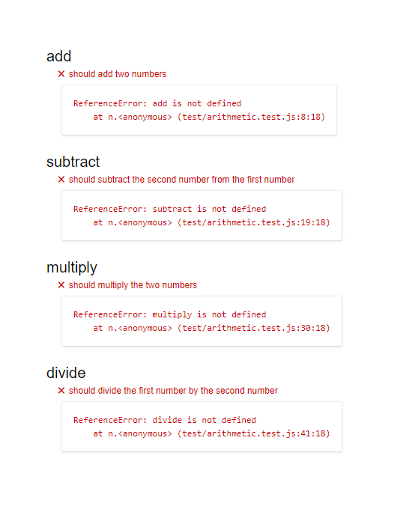
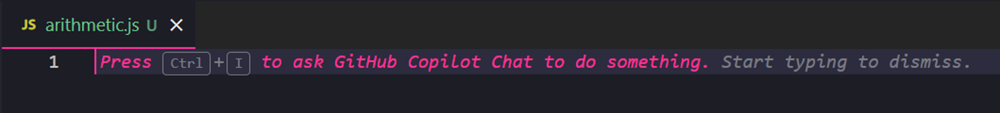
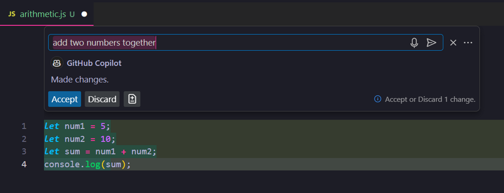
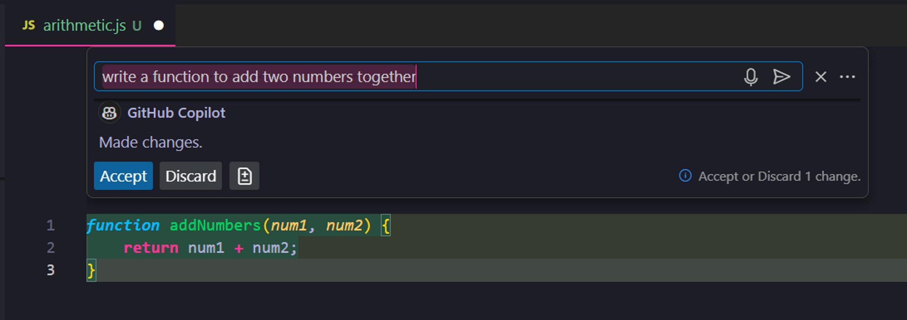
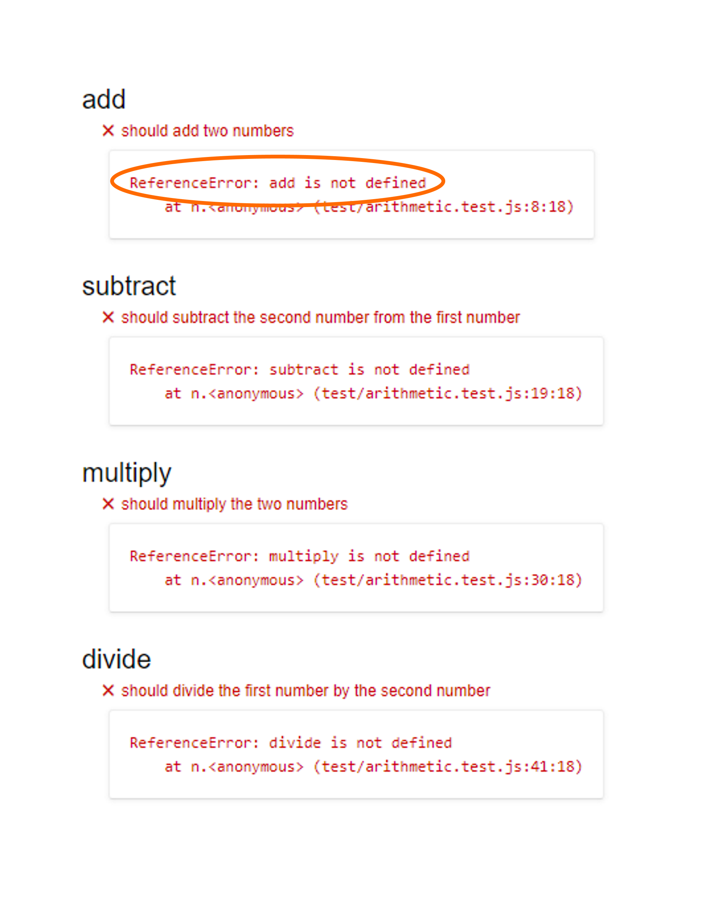
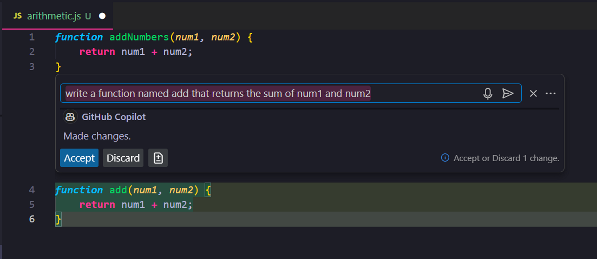
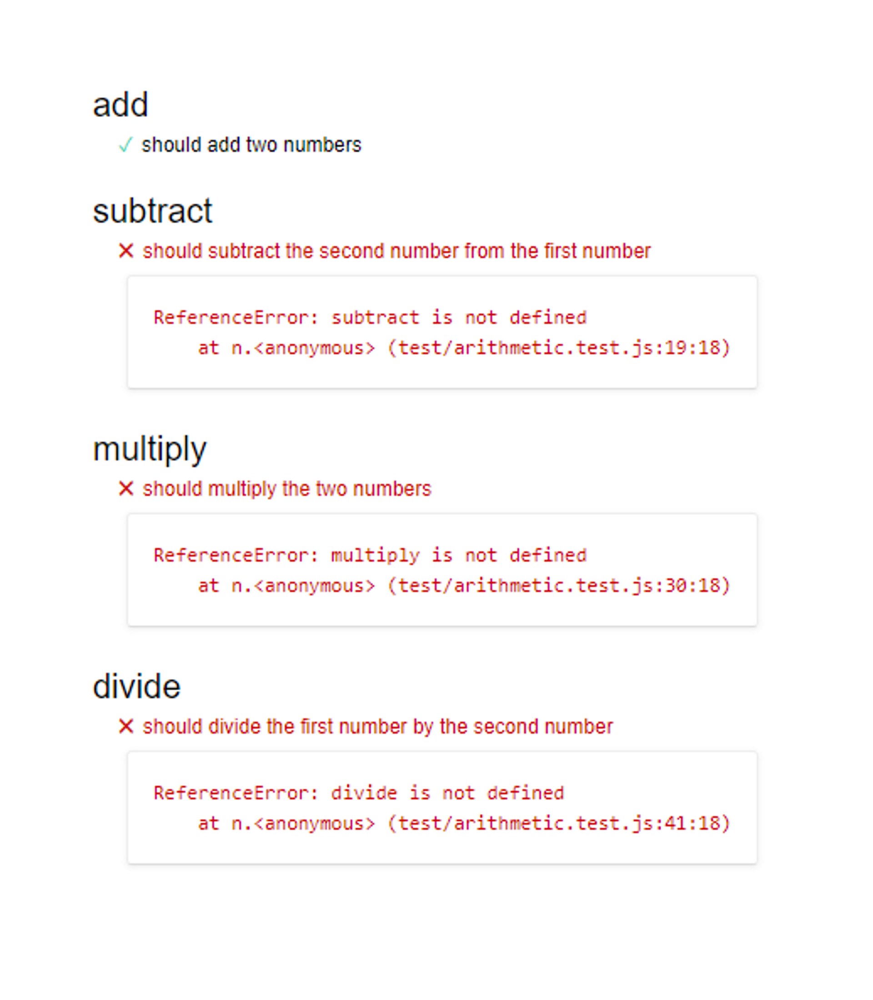

# Arithmetic

In this activity you will be writing code to create functions capable of different arithmetic operations. Work with GitHub Copilot to complete this activity.

**Note**: This activity includes a number of example responses from GitHub Copilot. Remember that the responses that you receive from GitHub Copilot may not exactly match the examples. This is expected.

## Instructions

* Open [Unsolved/test.html](Unsolved/test.html) in your web browser.

  * Functions that pass the tests will be denoted with a green check mark.

  * Functions that fail the tests will be denoted with a red X and an error message.

  * Currently, all of the tests are failing.

    

    **Note**: Keep this browser window open. Each time we write code for a function we will refresh this page to test if the code is working correctly.

* Open [Unsolved/arithmetic.js](Unsolved/arithmetic.js) in your code editor&mdash;this is the only file you will modify in this activity.

  * In this file, you will be writing code in the body of each function defined to accomplish the following:

    * `add` returns the result of `num1` plus `num2`.

    * `subtract` returns the result of `num1` minus `num2`.

    * `multiply` returns the result of `num1` times `num2`.

    * `divide` returns the result of `num1` divided by `num2`.

* Open GitHub Copilot Chat by pressing "Ctrl + I" on Windows or "Cmd + I" on macOS.

  

* For the first function, we need to add two numbers together. In the prompt for GitHub Copilot Chat, type the following text and press "Enter" to make your request:

  ```text
  add two numbers together
  ```

  

* GitHub Copilot generates JavaScript code to add two numbers together, but it's not written in a function. Click the "Discard" button.

  **Note**: It's important to understand that GitHub Copilot can only do what you ask it to do. As your experience with JavaScript increases, you will be able to make your prompts more specific. This will allow GitHub Copilot to provide you with better results.

* We'll make the prompt more specific to what we need. In the prompt for GitHub Copilot Chat, type the following text and press "Enter" to make your request:

  ```text
  write a function to add two numbers together
  ```

  

* Now, GitHub Copilot generates a function that adds two numbers together. Review the code and click the "Accept" button.

  **Important**: Another important thing to remember is that the output from GitHub Copilot may not always be correct. Any code generated by GitHub Copilot should be verified and tested to ensure it's working.

* Refresh the `test.html` page and notice that the tests are still failing. The error message for the first test is that "add is not defined."

  

  **Note**: In this situation, GitHub Copilot has generated valid JavaScript code, but the code has some additional requirements that we did not include in our prompt.

* We'll update the prompt to be even more specific. In the prompt for GitHub Copilot Chat, type the following text and press "Enter" to make your request:

  ```text
  write a function named add that returns the sum of num1 and num2
  ```

  

* GitHub Copilot generates a function named `add` that adds the `num1` and `num2` parameters together and returns the result. Review the code and click the "Accept" button.

* Refresh the `test.html` page and notice that the first test is now passing.

  

* Repeat this process for the remaining functions until all tests pass.

**Important**: Notice that the included arithmetic tests only handle basic cases. For example, the tests for the `divide` function do not handle division by zero. Be aware that the code generated by GitHub Copilot will typically not handle these cases either unless you specifically include these cases in your request.

### Resources

* Refer to the [GitHub Copilot Guide](https://coding-boot-camp.github.io/full-stack/github/github-copilot-guide) blog post for information on setting up and getting started with GitHub Copilot.

---

© 2024 edX Boot Camps LLC. Confidential and Proprietary. All Rights Reserved.
