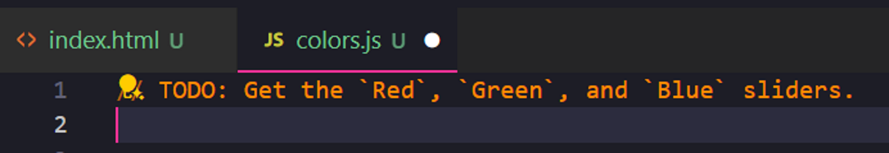
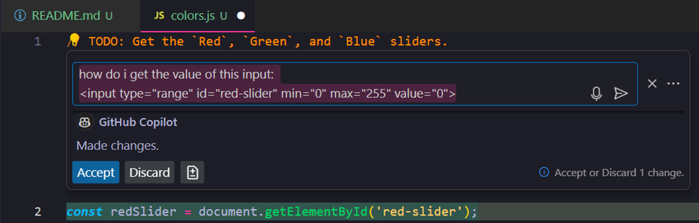
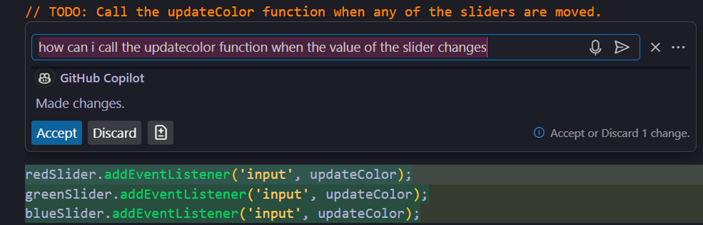
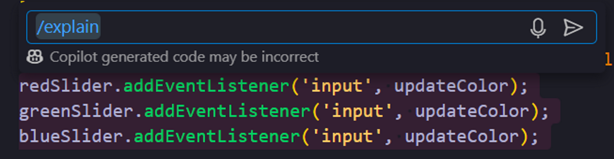
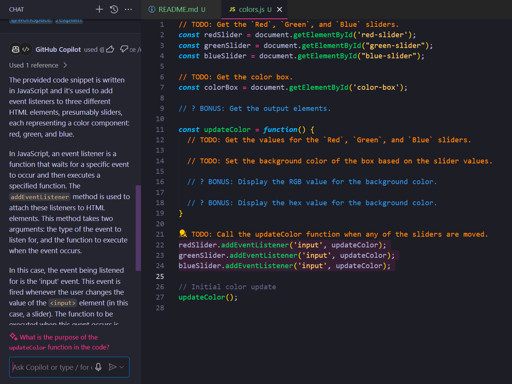
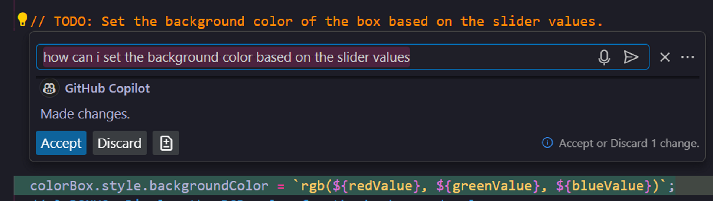
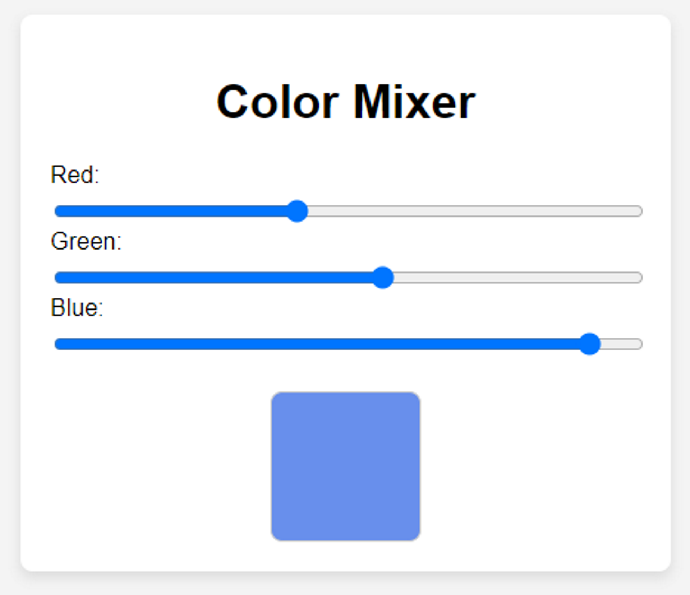
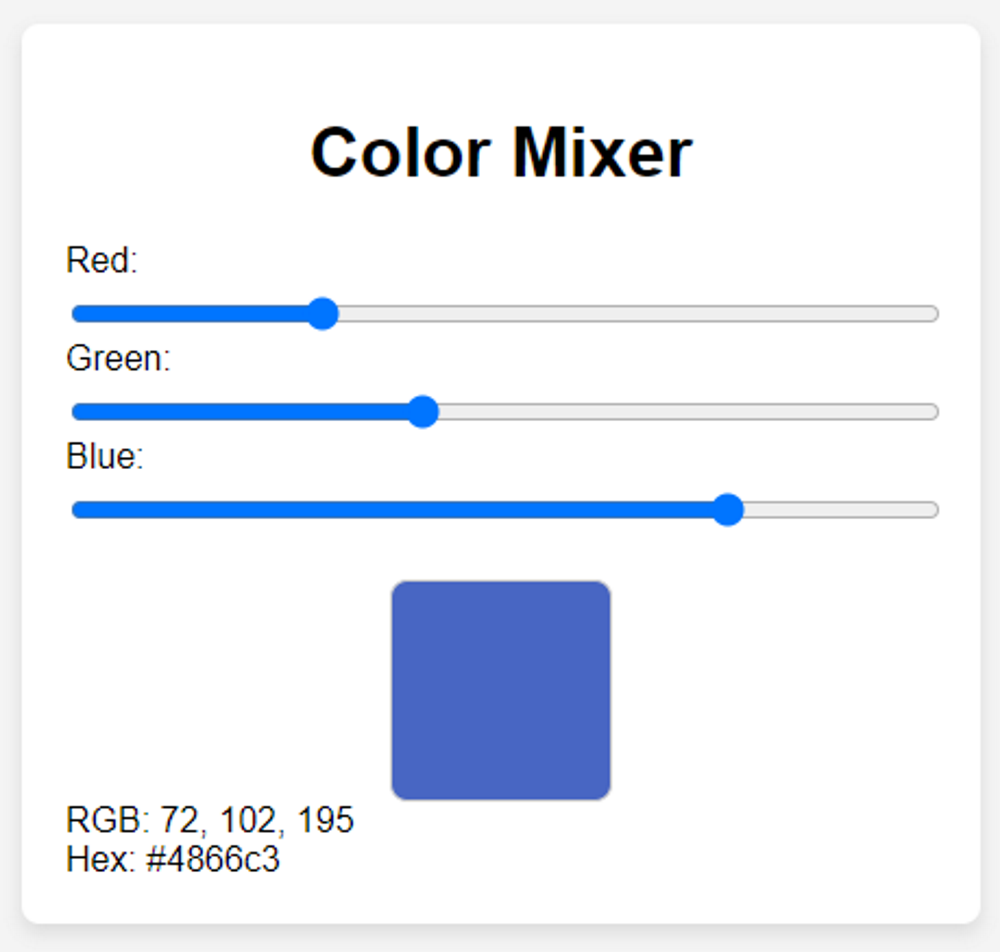

# Color Mixer

In this activity, you will be writing code to create a web page that allows you to mix together different values of red, blue, and green to create colors. Work with GitHub Copilot to complete this activity.

**Note**: This activity includes a number of example responses from GitHub Copilot. Remember that the responses that you receive from GitHub Copilot may not exactly match the examples. This is expected.

## Instructions

* Open [Unsolved/index.html](Unsolved/index.html) in your web browser.

  * Three sliders labeled `Red`, `Green`, and `Blue` are displayed.

  * An empty box is displayed.

  * Currently, changing the values of the sliders does not do anything.

    

* Open [Unsolved/assets/js/colors.js](Unsolved/assets/js/colors.js) in your code editor&mdash;this is the only file you will modify in this activity.

  * In this file there are a number of TODO comments that we'll need to complete.

* We'll begin with the first TODO and write code to get the sliders. In the `index.html` file, the `Red` slider has the following HTML:

  ```html
  <input type="range" id="red-slider" min="0" max="255" value="0">
  ```

* Copy the HTML for the slider.

* In the `colors.js` file, after the first TODO comment, open GitHub Copilot Chat by pressing "Ctrl + I" on Windows or "Cmd + I" on macOS.

  

* In the prompt for GitHub Copilot Chat, type the following text, paste the HTML for the slider, and press "Enter" to make your request:

  ```text
  how do i get the value of this input:
  <input type="range" id="red-slider" min="0" max="255" value="0">
  ```

  

**Important**: It's important to understand that GitHub Copilot can only do what you ask it to do. As your experience with JavaScript increases you will be able to make your prompts more specific. This will allow GitHub Copilot to provide you with better results.

* GitHub Copilot generates JavaScript code to get the `Red` slider, similar to the following example:

  ```js
  // TODO: Get the `Red`, `Green`, and `Blue` sliders.
  const redSlider = document.getElementById('red-slider');
  ```

* Review the code and, if the code is correct, click the "Accept" button.

* The generated JavaScript code is finding the slider based on the id of the HTML element. We should be able to use similar code to find the remaining sliders, as shown in the following example:

  ```js
  // TODO: Get the `Red`, `Green`, and `Blue` sliders.
  const redSlider = document.getElementById('red-slider');
  const greenSlider = document.getElementById("green-slider");
  const blueSlider = document.getElementById("blue-slider");
  ```

**Note**: Remember, GitHub Copilot is a tool that can assist us as developers. Using Copilot to help us write code has a benefit, but only if we understand and validate the code that it generates.

* In addition to the sliders, we also need to find the color box. We know we can use `document.getElementById` to find elements by id. Update the code to also find the color box, similar to the following code:

  ```js
  // Get the `Red`, `Green`, and `Blue` sliders.
  const redSlider = document.getElementById("red-slider");
  const greenSlider = document.getElementById("green-slider");
  const blueSlider = document.getElementById("blue-slider");

  // Get the color box.
  const colorBox = document.getElementById('color-box');
  ```

* Next, we'll add code to run the `updateColor` function when the value of a slider changes. In the `colors.js` file, after the TODO comment to call the `updateColor` function, open GitHub Copilot Chat. In the prompt for GitHub Copilot Chat, type the following text and press "Enter" to make your request:

  ```text
  how can i call the updatecolor function when the value of the slider changes
  ```

  

* GitHub Copilot generates code to add event listeners for each of the sliders. Review the code and, if the code is correct, click the "Accept" button.

  ```js
  // TODO: Call the updateColor function when any of the sliders are moved.
  redSlider.addEventListener('input', updateColor);
  greenSlider.addEventListener('input', updateColor);
  blueSlider.addEventListener('input', updateColor);
  ```

**Important**: It's important to understand and validate the code that GitHub Copilot generates. If you do not fully understand the code, you can ask GitHub Copilot to explain it.

* Select the code for the event listeners and open GitHub Copilot Chat. In the prompt for GitHub Copilot Chat, type the following text and press "Enter" to make your request:

  ```text
  /explain
  ```

  

* GitHub Copilot Chat will open in the sidebar of Visual Studio Code and provide an explanation of the code, as shown in the following image:

  

* Next, we'll add code to the `updateColor` function to get the values from the sliders. The updated code should be similar to the following:

  ```js
  const updateColor = function() {
    // TODO: Get the values for the `Red`, `Green`, and `Blue` sliders.
    const redValue = redSlider.value;
    const greenValue = greenSlider.value;
    const blueValue = blueSlider.value;

    // TODO: Set the background color of the box based on the slider values.

    // ? BONUS: Display the RGB value for the background color.

    // ? BONUS: Display the hex value for the background color.
  }
  ```

* Now, we'll need to change the color of the box based on the slider values. In the `updateColor` function, after the TODO comment to set the background color based on the slider values, open GitHub Copilot Chat. In the prompt for GitHub Copilot Chat, type the following text and press "Enter" to make your request:

  ```text
  how can i set the background color based on the slider values
  ```

  

* GitHub Copilot generates code to set the background color based on the slider values. Review the code and, if the code is correct, click the "Accept" button.

  ```js
  const updateColor = function() {
    // TODO: Get the values for the `Red`, `Green`, and `Blue` sliders.
    const redValue = redSlider.value;
    const greenValue = greenSlider.value;
    const blueValue = blueSlider.value;

    // TODO: Set the background color of the box based on the slider values.
    colorBox.style.backgroundColor = `rgb(${redValue}, ${greenValue}, ${blueValue})`;

    // ? BONUS: Display the RGB value for the background color.

    // ? BONUS: Display the hex value for the background color.
  }
  ```

* The completed code in `colors.js` will be similar to the following:

  ```js
  // TODO: Get the `Red`, `Green`, and `Blue` sliders.
  const redSlider = document.getElementById('red-slider');
  const greenSlider = document.getElementById("green-slider");
  const blueSlider = document.getElementById("blue-slider");

  // TODO: Get the color box.
  const colorBox = document.getElementById('color-box');

  // ? BONUS: Get the output elements.

  const updateColor = function() {
    // TODO: Get the values for the `Red`, `Green`, and `Blue` sliders.
    const redValue = redSlider.value;
    const greenValue = greenSlider.value;
    const blueValue = blueSlider.value;

    // TODO: Set the background color of the box based on the slider values.
    colorBox.style.backgroundColor = `rgb(${redValue}, ${greenValue}, ${blueValue})`;

    // ? BONUS: Display the RGB value for the background color.

    // ? BONUS: Display the hex value for the background color.
  }

  // TODO: Call the updateColor function when any of the sliders are moved.
  redSlider.addEventListener('input', updateColor);
  greenSlider.addEventListener('input', updateColor);
  blueSlider.addEventListener('input', updateColor);

  // Initial color update
  updateColor();
  ```

* Open [Unsolved/index.html](Unsolved/index.html) in your web browser and verify that the Color Mixer is now working.

  

### Resources

* Refer to the [GitHub Copilot Guide](https://coding-boot-camp.github.io/full-stack/github/github-copilot-guide) blog post for information on setting up and getting started with GitHub Copilot.

### Bonus

* For an additional challenge, try completing the code to display the RGB and hex values for the current color. Follow the Bonus comments to add the missing functionality. The completed Color Mixer should appear similar to the following:

  

---

© 2024 edX Boot Camps LLC. Confidential and Proprietary. All Rights Reserved.
